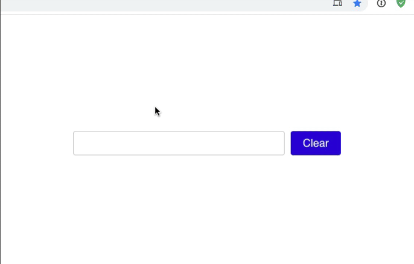

# React Autocomplete App - Bootcamp study project

## ⚡ To do

This workshop challenges you to build a common reusable component: The **Typeahead**.

Also called an **Autocomplete**, this component is designed to give users suggestions as they type, and allow the user to pick between the presented options.

Here's a finished working demo:

