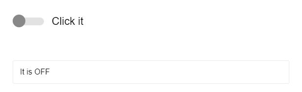

# Building a Toggle

## What is a Toggle?

UI widget similar to a **checkbox**

---

React is _great_ for these types of UI widgets.

Let's build one together!

---

### Requirements

- Receives `checked` and `handleChange` props
- Works on click: invokes the function, ball slides from side to side
- Is keyboard accessible
- Works with a screen reader

[Go!](https://codesandbox.io/s/toggle-activity-oyg83)
